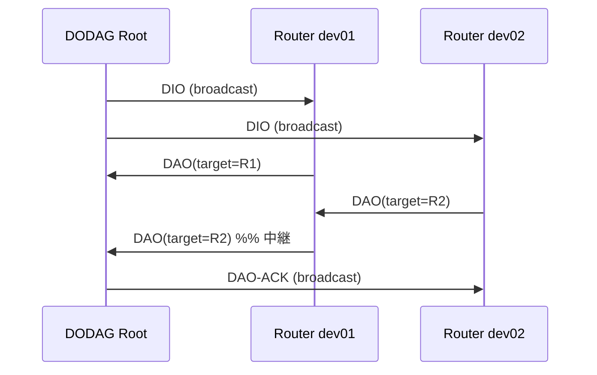

# Nishioka RPL-like ルーティングひな形

Nishiokaプロトコルを **RPL（RFC 6550）に着想を得たツリー型ルーティング**へ段階的に拡張するためのスキャフォールドです。  
完全な RPL 実装ではなく、**構造・責務分担・ヘルパー関係**を先に固定し、制御メッセージ処理を少しずつ肉付けしていくことを目的としています。

## 1. レイヤ構造

```
+-------------------------------------------------------------+
| Application / Example (nishioka-rpl-scaffold.cc)            |
|  - データ送受信コールバック登録                               |
|  - DODAG 開始・テスト送信スケジュール                         |
+---------------------------+---------------------------------+
                            | NishiokaRplHelper API
                            v
+-------------------------------------------------------------+
| NishiokaRplHelper                                           |
|  - Install(): Stack + NishiokaRplNwk 差し替え               |
|  - ConfigureDodagRoot() / StartDodag()                      |
|  - SendData(): NishiokaHelper 経由でデータ送信               |
|  - 内部で NishiokaHelper を保持（委譲）                      |
+---------------------------+---------------------------------+
                            |
          +-----------------+------------------+
          v                 v                  v
+----------------+  +----------------+  +---------------------+
| NishiokaHelper |  | NishiokaStack  |  | NishiokaStackContainer|
| パケット生成    |  | MAC <-> NWK    |  | 複数 Stack 管理       |
| ヘッダ抽出      |  | 接続           |  |                       |
| MAC 設定        |  +-------+--------+  +---------------------+
+----------------+          |
                            v
                   +------------------+
                   | NishiokaRplNwk   |  extends NishiokaNwk
                   |  RPL制御振り分け  |
                   +--------+---------+
                            |
                            v
                   +------------------+
                   | NishiokaRplRouting|
                   |  DIO/DAO/DAO-ACK  |
                   |  親選択・下向き経路 |
                   +--------+---------+
                            |
                            v
                   +------------------+
                   | NishiokaNwk       |
                   |  m_routingTable   |  <- データ転送用 nextHop
                   +--------+---------+
                            |
                            v
                   +------------------+
                   | LrWpanMac (802.15.4)|
                   +-------------------+
```

## 2. ファイル構成と責務

| パス | クラス / 役割 |
|------|----------------|
| `model/nishioka-rpl-fields.h` | RPL 定数・列挙（`RplControlType`, `RplNodeRole`, `RplDodagInfo`） |
| `model/nishioka-rpl-payload-header.h/.cc` | 制御ペイロード（`RplDioHeader`, `RplDaoHeader`, `RplDaoAckHeader`） |
| `model/nishioka-rpl-tables.h/.cc` | RPL 内部テーブル（親・下向き経路） |
| `model/nishioka-rpl-routing.h/.cc` | **RPL 状態機械**（DIO 送信、親選択、DAO 伝播、NWK テーブル反映） |
| `model/nishioka-rpl-nwk.h/.cc` | NWK 層。`CUSTOM_COMMAND` を RPL として処理し、それ以外は従来どおり上位へ |
| `helper/nishioka-rpl-helper.h/.cc` | シミュレーション向けファサード |
| `examples/nishioka-rpl-scaffold.cc` | 3 ノード線形トポロジの動作確認例 |

既存モジュールとの関係:

| 既存 | RPL ひな形での位置づけ |
|------|------------------------|
| `NishiokaHeader` | データは `CUSTOM_DATA`、RPL 制御は `CUSTOM_COMMAND` + RPL ペイロード |
| `NishiokaHelper` | パケット操作は **そのまま再利用**（RplHelper が内包） |
| `NishiokaNwk::m_routingTable` | DAO 処理結果を `SetRoute()` で反映し、データ平面転送に使用 |
| `NishiokaStack` | 変更なし。`SetNwk(NishiokaRplNwk)` で RPL 対応 NWK に差し替え |

## 3. ヘルパー間の関係（詳細）

### 3.1 NishiokaRplHelper → NishiokaHelper（委譲）

```
NishiokaRplHelper
  ├── Install()           → NishiokaHelper::Install() の後に NishiokaRplNwk を SetNwk()
  ├── ConfigureMac()      → NishiokaHelper::ConfigureMac() + BindAddresses()
  ├── GetNishiokaHelper() → 直接アクセス（CreatePacket / ExtractHeader 等）
  └── SendData()          → NishiokaHelper::CreatePacket() + MAC 送信
```

**原則**: ヘッダ操作・シーケンス番号は `NishiokaHelper`、DODAG・制御メッセージは `NishiokaRplHelper` / `NishiokaRplRouting`。

### 3.2 NishiokaRplHelper → NishiokaRplNwk / NishiokaRplRouting

```
ConfigureDodagRoot(stack) → GetRplRouting(stack)->ConfigureAsRoot()
StartDodag(stack)         → GetRplRouting(stack)->StartDodag()
BindAddresses(stack)      → GetRplNwk(stack)->SetPanId/SetShortAddress()
```

静的アクセサ `GetRplNwk()` / `GetRplRouting()` で Stack から RPL オブジェクトを取得します。

### 3.3 NishiokaRplNwk → NishiokaRplRouting

- `NishiokaRplNwk::McpsDataIndication()` が入口
- `CUSTOM_COMMAND` + RPL タイプなら `NishiokaRplRouting::HandleDio/Dao/DaoAck`
- それ以外（`CUSTOM_DATA` 等）は `NishiokaNwk::McpsDataIndication()` → アプリコールバック

### 3.4 NishiokaRplRouting → NishiokaNwk

- 親選択後: `InstallDefaultUpwardRoute()` で root 方向の経路を `SetRoute(dodagId, parent)`
- DAO 受信後: `InstallDownwardRoute()` で `SetRoute(target, nextHop)`

データ転送時は **従来の `NishiokaNwk::GetNextHop()`** をそのまま利用します（`multihop-static-lrwpan.cc` と同じデータ平面）。

## 4. 制御平面フロー（ひな形の動作）



1. **Root** が `StartDodag()` で周期的に DIO をブロードキャスト
2. **子ノード** が DIO を受信し、より良い rank の親を選択 → DAO を親方向へ送信
3. **中継ノード** が DAO を親へ転送
4. **Root** が下向き経路を `NishiokaNwk` にインストールし DAO-ACK を返す（簡略版）

## 5. データ平面フロー

1. `NishiokaRplHelper::SendData()` または `NishiokaHelper::CreatePacket()` で `CUSTOM_DATA` 生成
2. 送信元の `NishiokaNwk::GetNextHop(finalDst)` で MAC 宛先（next hop）を決定
3. 中継ノードは NWK コールバック（例: `RelayOrDeliver`）でホップ数を更新して再送信

## 6. ビルドと実行

```bash
./ns3 configure --enable-examples
./ns3 build
./ns3 run nishioka-rpl-scaffold
```

## 7. 今後の実装 TODO（意図的に空けている箇所）

| 項目 | 参照 RFC | 現在の状態 |
|------|----------|------------|
| Trickle タイマ (DIO) | RFC 6206 | 固定間隔 `RPL_DEFAULT_DIO_INTERVAL_SEC` |
| Rank 計算 / Objective Function | RFC 6550 §3.5 | 単純な `parentRank + 256` |
| DIS / グラウンディング | RFC 6550 | 列挙のみ定義 |
| DAO 再送・DAO-ACK 処理 | RFC 6550 | ログのみ |
| セキュリティ (MIC) | RFC 6550 | 未対応 |
| IPv6 / プレフィックス | RFC 6550 | Mac16Address ベースの簡略 DAO |

## 8. 静的ルーティングからの移行指針

| 従来 (`multihop-static-lrwpan`) | RPL ひな形 |
|----------------------------------|------------|
| `nwk->SetRoute()` を手動で全ノードに設定 | DAO により自動インストール（目標） |
| アプリが MAC コールバックを直接登録 | **NWK コールバック**を登録（RPL 制御を NWK が先に処理） |
| `NishiokaHelper` のみ | `NishiokaRplHelper` + 内部 `NishiokaHelper` |

## 9. 関連ドキュメント

- [NISHIOKA_HELPER_DETAILED.md](NISHIOKA_HELPER_DETAILED.md) — NishiokaHelper の API
- [NISHIOKA_NWK_EXPLANATION.md](NISHIOKA_NWK_EXPLANATION.md) — NWK 層の役割
- [README_NISHIOKA_STACK_SIMPLE.md](README_NISHIOKA_STACK_SIMPLE.md) — Stack インストール手順
